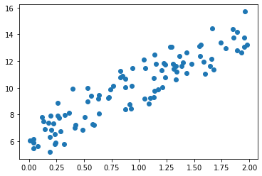
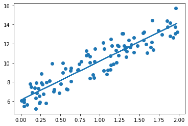
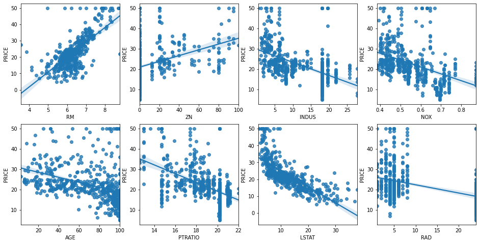
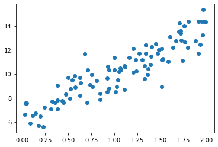
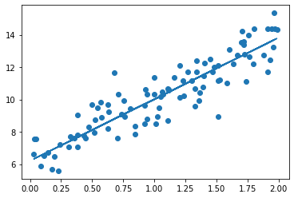
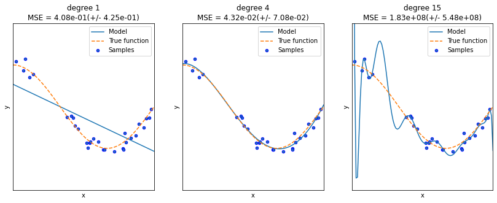
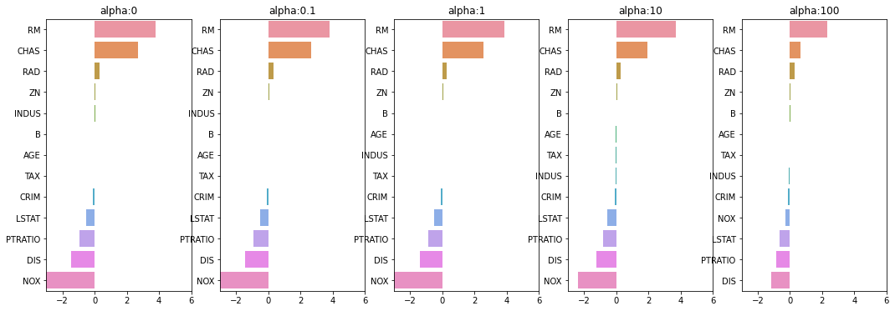

---
layout:single
title:"sklearn posting test"
---

```python
import numpy as np
import matplotlib.pyplot as plt
%matplotlib inline

np.random.seed(0)

X= 2*np.random.rand(100,1)
y = 6+4*X+np.random.randn(100,1)

plt.scatter(X, y)
```


    <matplotlib.collections.PathCollection at 0x22c25d8a460>


    

    


```python
X= np.random.rand(100,1)
X.shape
```


    (100, 1)


```python
def get_cost(y, y_pred):
    N = len(y)
    cost = np.sum(np.square(y- y_pred))/N
    return cost
```


```python
def get_weight_updates(w1, w0, X, y, learning_rate=0.01):
    N = len(y)
    w1_update = np.zeros_like(w1)
    w0_update = np.zeros_like(w0)
    y_pred = np.dot(X, w1.T) + w0
    diff = y - y_pred
    
    w0_factors = np.ones((N, 1))
    
    w1_update = -(2/N)*learning_rate*(np.dot(X.T, diff))
    w0_update = -(2/N)*learning_rate*(np.dot(w0_factors.T, diff))
    
    return w1_update, w0_update
```


```python
def gradient_descent_steps(X, y, iters=10000):
    w0 = np.zeros((1, 1))
    w1 = np.zeros((1, 1))
    
    for ind in range(iters):
        w1_update, w0_update = get_weight_updates(w1, w0, X, y, learning_rate=0.01)
        w1 = w1 - w1_update
        w0 = w0 - w0_update
    
    return w1, w0
```


```python
def get_cost(y, y_pred):
    N = len(y)
    cost = np.sum(np.square(y - y_pred))/N
    return cost

w1, w0 = gradient_descent_steps(X, y, iters=1000)
print('w1:{0:.3f} w0:{1:.3f}'.format(w1[0,0], w0[0,0]))
y_pred = w1[0,0] * X + w0
print('Gradient Descent Total Cost:{0:.4f}'.format(get_cost(y, y_pred)))
```

    w1:4.022 w0:6.162
    Gradient Descent Total Cost:0.9935
    


```python
plt.scatter(X, y)
plt.plot(X, y_pred)
```


    [<matplotlib.lines.Line2D at 0x22c2171c400>]


    

    


```python
def stochastic_gradient_descent_steps(X, y, batch_size=10, iters=1000):
    w0 = np.zeros((1, 1))
    w1 = np.zeros((1,1))
    prev_cost = 100000
    iter_index = 0
    
    for ind in range(iters):
        np.random.seed(ind)
        stochastic_random_index = np.random.permutation(X.shape[0])
        sample_X = X[stochastic_random_index[0:batch_size]]
        sample_y = y[stochastic_random_index[0:batch_size]]
        
        w1_update, w0_update = get_weight_updates(w1, w0, sample_X, sample_y, learning_rate=0.01)
        w1 = w1 - w1_update
        w0 = w0 - w0_update
        
    return w1, w0
```


```python
w1, w0 = stochastic_gradient_descent_steps(X, y, iters=1000)
print('w1:', round(w1[0,0], 3), 'w0:', round(w0[0,0], 3))
y_pred = w1[0,0]*X + w0
print('Stochastic Gradient Descent Total Cost:{0:.4f}'.format(get_cost(y, y_pred)))
```

    w1: 4.028 w0: 6.156
    Stochastic Gradient Descent Total Cost:0.9937
    


```python
class sklearn.linear_model.LinearRegression(fit_intercept=True, normalize=False, copy_X=True, n_jobs=1)
```


      File "<ipython-input-65-1cefb1a956ca>", line 1
        class sklearn.linear_model.LinearRegression(fit_intercept=True, normalize=False, copy_X=True, n_jobs=1)
                     ^
    SyntaxError: invalid syntax
    


```python
import numpy as np
import matplotlib.pyplot as plt
import seaborn as sns
import pandas as pd
from scipy import stats
from sklearn.datasets import load_boston
import warnings
warnings.filterwarnings('ignore')
%matplotlib inline

boston = load_boston()

bostonDF = pd.DataFrame(boston.data, columns=boston.feature_names)
bostonDF['PRICE'] = boston.target
print('Boston 데이터 세트 크기 :',bostonDF.shape)
bostonDF.head(5)
```

    Boston 데이터 세트 크기 : (506, 14)
    


<div>
<style scoped>
    .dataframe tbody tr th:only-of-type {
        vertical-align: middle;
    }

    .dataframe tbody tr th {
        vertical-align: top;
    }

    .dataframe thead th {
        text-align: right;
    }
</style>
<table border="1" class="dataframe">
  <thead>
    <tr style="text-align: right;">
      <th></th>
      <th>CRIM</th>
      <th>ZN</th>
      <th>INDUS</th>
      <th>CHAS</th>
      <th>NOX</th>
      <th>RM</th>
      <th>AGE</th>
      <th>DIS</th>
      <th>RAD</th>
      <th>TAX</th>
      <th>PTRATIO</th>
      <th>B</th>
      <th>LSTAT</th>
      <th>PRICE</th>
    </tr>
  </thead>
  <tbody>
    <tr>
      <th>0</th>
      <td>0.00632</td>
      <td>18.0</td>
      <td>2.31</td>
      <td>0.0</td>
      <td>0.538</td>
      <td>6.575</td>
      <td>65.2</td>
      <td>4.0900</td>
      <td>1.0</td>
      <td>296.0</td>
      <td>15.3</td>
      <td>396.90</td>
      <td>4.98</td>
      <td>24.0</td>
    </tr>
    <tr>
      <th>1</th>
      <td>0.02731</td>
      <td>0.0</td>
      <td>7.07</td>
      <td>0.0</td>
      <td>0.469</td>
      <td>6.421</td>
      <td>78.9</td>
      <td>4.9671</td>
      <td>2.0</td>
      <td>242.0</td>
      <td>17.8</td>
      <td>396.90</td>
      <td>9.14</td>
      <td>21.6</td>
    </tr>
    <tr>
      <th>2</th>
      <td>0.02729</td>
      <td>0.0</td>
      <td>7.07</td>
      <td>0.0</td>
      <td>0.469</td>
      <td>7.185</td>
      <td>61.1</td>
      <td>4.9671</td>
      <td>2.0</td>
      <td>242.0</td>
      <td>17.8</td>
      <td>392.83</td>
      <td>4.03</td>
      <td>34.7</td>
    </tr>
    <tr>
      <th>3</th>
      <td>0.03237</td>
      <td>0.0</td>
      <td>2.18</td>
      <td>0.0</td>
      <td>0.458</td>
      <td>6.998</td>
      <td>45.8</td>
      <td>6.0622</td>
      <td>3.0</td>
      <td>222.0</td>
      <td>18.7</td>
      <td>394.63</td>
      <td>2.94</td>
      <td>33.4</td>
    </tr>
    <tr>
      <th>4</th>
      <td>0.06905</td>
      <td>0.0</td>
      <td>2.18</td>
      <td>0.0</td>
      <td>0.458</td>
      <td>7.147</td>
      <td>54.2</td>
      <td>6.0622</td>
      <td>3.0</td>
      <td>222.0</td>
      <td>18.7</td>
      <td>396.90</td>
      <td>5.33</td>
      <td>36.2</td>
    </tr>
  </tbody>
</table>
</div>


```python
bostonDF.info()
```

    <class 'pandas.core.frame.DataFrame'>
    RangeIndex: 506 entries, 0 to 505
    Data columns (total 14 columns):
     #   Column   Non-Null Count  Dtype  
    ---  ------   --------------  -----  
     0   CRIM     506 non-null    float64
     1   ZN       506 non-null    float64
     2   INDUS    506 non-null    float64
     3   CHAS     506 non-null    float64
     4   NOX      506 non-null    float64
     5   RM       506 non-null    float64
     6   AGE      506 non-null    float64
     7   DIS      506 non-null    float64
     8   RAD      506 non-null    float64
     9   TAX      506 non-null    float64
     10  PTRATIO  506 non-null    float64
     11  B        506 non-null    float64
     12  LSTAT    506 non-null    float64
     13  PRICE    506 non-null    float64
    dtypes: float64(14)
    memory usage: 55.5 KB
    


```python
fig, axs = plt.subplots(figsize=(16, 8), ncols=4, nrows=2)
lm_features = ['RM', 'ZN', 'INDUS', 'NOX', 'AGE', 'PTRATIO', 'LSTAT', 'RAD']
for i, feature in enumerate(lm_features):
    row = int(i/4)
    col = i%4
    
    sns.regplot(x=feature, y='PRICE', data=bostonDF, ax=axs[row][col])
```


    

    


```python
from sklearn.model_selection import train_test_split
from sklearn.linear_model import LinearRegression
from sklearn.metrics import mean_squared_error, r2_score

y_target = bostonDF['PRICE']
X_data = bostonDF.drop(['PRICE'], axis=1, inplace=False)

X_train, X_test, y_train, y_test = train_test_split(X_data, y_target, test_size=0.3, random_state=156)

lr = LinearRegression()
lr.fit(X_train, y_train)
y_preds = lr.predict(X_test)
mse = mean_squared_error(y_test, y_preds)
rmse = np.sqrt(mse)

print('MSE : {0:.3f}, RMSE : {1:.3F}'.format(mse, rmse))
print('Variance_score : {0:.3f}'.format(r2_score(y_test, y_preds)))
```

    MSE : 17.297, RMSE : 4.159
    Variance_score : 0.757
    


```python
print('절편 값:',lr.intercept_)
print('회귀 계수값:', np.round(lr.coef_, 1))
```

    절편 값: 40.995595172164336
    회귀 계수값: [ -0.1   0.1   0.    3.  -19.8   3.4   0.   -1.7   0.4  -0.   -0.9   0.
      -0.6]
    


```python
coeff = pd.Series(data=np.round(lr.coef_, 1), index=X_data.columns)
coeff.sort_values(ascending=False)
```


    RM          3.4
    CHAS        3.0
    RAD         0.4
    ZN          0.1
    INDUS       0.0
    AGE         0.0
    TAX        -0.0
    B           0.0
    CRIM       -0.1
    LSTAT      -0.6
    PTRATIO    -0.9
    DIS        -1.7
    NOX       -19.8
    dtype: float64


```python
from sklearn.model_selection import cross_val_score

y_target = bostonDF['PRICE']
x_data = bostonDF.drop(['PRICE'], axis=1, inplace= False)
lr = LinearRegression()

neg_mse_scores = cross_val_score(lr, X_data, y_target, scoring='neg_mean_squared_error', cv = 5)
rmse_scores = np.sqrt(-1*neg_mse_scores)
avg_rmse = np.mean(rmse_scores)

print(' 5 folds 의 개별 Negative MSE Score: ', np.round(neg_mse_scores, 2))
print(' 5 folds 의 개별 RMSE scores : ', np.round(rmse_scores, 2))
print(' 5 folds 의 평균 RMSE : {0:.3f} '.format(avg_rmse))
```

     5 folds 의 개별 Negative MSE Score:  [-12.46 -26.05 -33.07 -80.76 -33.31]
     5 folds 의 개별 RMSE scores :  [3.53 5.1  5.75 8.99 5.77]
     5 folds 의 평균 RMSE : 5.829 
    


```python
neg_mse_scores
```


    array([-12.46030057, -26.04862111, -33.07413798, -80.76237112,
           -33.31360656])


```python
import numpy as np
import matplotlib.pyplot as plt
%matplotlib inline

X = 2*np.random.rand(100,1)
y = 6+4*X+np.random.randn(100,1)

plt.scatter(X, y)
```


    <matplotlib.collections.PathCollection at 0x22c26e8f5e0>


    

    


```python
def get_cost(y, y_pred):
    N = len(y)
    cost = np.sum(np.square(y - y_pred))/N
    return cost
```


```python
def get_weight_updates(w1, w0, X, y, learning_rate=0.01):
    N = len(y)
    
    w1_update = np.zeros_like(w1)
    w0_update = np.zeros_like(w0)
    
    y_pred = np.dot(X, w1.T) + w0
    diff = y-y_pred
    
    w0_factors = np.ones((N, 1))
    w1_update = -(2/N)*learning_rate*(np.dot(X.T, diff))
    w0_update = -(2/N)*learning_rate*(np.dot(w0_factors.T, diff))
    
    return w1_update, w0_update
```


```python
def gradient_descnet_steps(X, y, iters=10000):
    w0 = np.zeros((1, 1))
    w1 = np.zeros((1, 1))
    
    for ind in range(iters):
        w1_update, w0_update = get_weight_updates(w1, w0, X, y, learning_rate=0.01)
        w1 = w1 - w1_updates
        w0 = w0 - w0_updates
        
    return w1, w0
```


```python
def get_cost(y, y_pred):
    N = len(y)
    cost = np.sum(np.square(y - y_pred))/N
    return cost

w1, w0 = gradient_descent_steps(X, y, iters=1000)
print('w1:{0:.3f} w0:{1:.3f}'.format(w1[0, 0], w0[0, 0]))
y_pred = w1[0,0]* X + w0
print('Gradient Descent Total Cost:{0:.4f}'.format(get_cost(y, y_pred)))
```

    w1:3.806 w0:6.212
    Gradient Descent Total Cost:0.9333
    


```python
plt.scatter(X, y)
plt.plot(X, y_pred)
```


    [<matplotlib.lines.Line2D at 0x22c26feccd0>]


    

    


```python
def stochastic_gradient_descent_steps(X, y, batch_size=10, iters=1000):
    w0 = np.zeros((1, 1))
    w1 = np.zeros((1, 1))
    
    prev_cost = 100000
    iter_index = 0
    
    for ind in range(iters):
        np.random.seed(ind)
        
        stochastic_random_index = np.random.permutation(X.shape[0])
        sample_X = X[stochastic_random_index[0:batch_size]]
        sample_y = y[stochastic_random_index[0:batch_size]]
        
        w1_update, w0_update = get_weight_updates(w1, w0, sample_X, sample_y, learning_rate=0.01)
        w1 = w1 - w1_update
        w0 = w0 - w0_update
        
    return w1, w0
```


```python
w1, w0 = stochastic_gradient_descent_steps(X, y, iters=1000)
print("w1:", round(w1[0, 0], 3), "w0:", round(w0[0, 0], 3))
y_pred = w1[0, 0]*  X + w0
print('Stochastic Gradient Descent Total Cost : {0:.4f}'.format(get_cost(y, y_pred)))
```

    w1: 3.801 w0: 6.218
    Stochastic Gradient Descent Total Cost : 0.9329
    


```python
import numpy as np
import matplotlib.pyplot as plt
import pandas as pd
import seaborn as sns
from scipy import stats
from sklearn.datasets import load_boston
import warnings
warnings.filterwarnings('ignore')

%matplotlib inline

boston = load_boston()

bostonDF = pd.DataFrame(boston.data, columns = boston.feature_names)

bostonDF['PRICE'] = boston.target
print('Boston 데이터 세트 크기 : ', bostonDF.shape)
bostonDF.head()
```

    Boston 데이터 세트 크기 :  (506, 14)
    


<div>
<style scoped>
    .dataframe tbody tr th:only-of-type {
        vertical-align: middle;
    }

    .dataframe tbody tr th {
        vertical-align: top;
    }

    .dataframe thead th {
        text-align: right;
    }
</style>
<table border="1" class="dataframe">
  <thead>
    <tr style="text-align: right;">
      <th></th>
      <th>CRIM</th>
      <th>ZN</th>
      <th>INDUS</th>
      <th>CHAS</th>
      <th>NOX</th>
      <th>RM</th>
      <th>AGE</th>
      <th>DIS</th>
      <th>RAD</th>
      <th>TAX</th>
      <th>PTRATIO</th>
      <th>B</th>
      <th>LSTAT</th>
      <th>PRICE</th>
    </tr>
  </thead>
  <tbody>
    <tr>
      <th>0</th>
      <td>0.00632</td>
      <td>18.0</td>
      <td>2.31</td>
      <td>0.0</td>
      <td>0.538</td>
      <td>6.575</td>
      <td>65.2</td>
      <td>4.0900</td>
      <td>1.0</td>
      <td>296.0</td>
      <td>15.3</td>
      <td>396.90</td>
      <td>4.98</td>
      <td>24.0</td>
    </tr>
    <tr>
      <th>1</th>
      <td>0.02731</td>
      <td>0.0</td>
      <td>7.07</td>
      <td>0.0</td>
      <td>0.469</td>
      <td>6.421</td>
      <td>78.9</td>
      <td>4.9671</td>
      <td>2.0</td>
      <td>242.0</td>
      <td>17.8</td>
      <td>396.90</td>
      <td>9.14</td>
      <td>21.6</td>
    </tr>
    <tr>
      <th>2</th>
      <td>0.02729</td>
      <td>0.0</td>
      <td>7.07</td>
      <td>0.0</td>
      <td>0.469</td>
      <td>7.185</td>
      <td>61.1</td>
      <td>4.9671</td>
      <td>2.0</td>
      <td>242.0</td>
      <td>17.8</td>
      <td>392.83</td>
      <td>4.03</td>
      <td>34.7</td>
    </tr>
    <tr>
      <th>3</th>
      <td>0.03237</td>
      <td>0.0</td>
      <td>2.18</td>
      <td>0.0</td>
      <td>0.458</td>
      <td>6.998</td>
      <td>45.8</td>
      <td>6.0622</td>
      <td>3.0</td>
      <td>222.0</td>
      <td>18.7</td>
      <td>394.63</td>
      <td>2.94</td>
      <td>33.4</td>
    </tr>
    <tr>
      <th>4</th>
      <td>0.06905</td>
      <td>0.0</td>
      <td>2.18</td>
      <td>0.0</td>
      <td>0.458</td>
      <td>7.147</td>
      <td>54.2</td>
      <td>6.0622</td>
      <td>3.0</td>
      <td>222.0</td>
      <td>18.7</td>
      <td>396.90</td>
      <td>5.33</td>
      <td>36.2</td>
    </tr>
  </tbody>
</table>
</div>


```python
bostonDF.info()
```

    <class 'pandas.core.frame.DataFrame'>
    RangeIndex: 506 entries, 0 to 505
    Data columns (total 14 columns):
     #   Column   Non-Null Count  Dtype  
    ---  ------   --------------  -----  
     0   CRIM     506 non-null    float64
     1   ZN       506 non-null    float64
     2   INDUS    506 non-null    float64
     3   CHAS     506 non-null    float64
     4   NOX      506 non-null    float64
     5   RM       506 non-null    float64
     6   AGE      506 non-null    float64
     7   DIS      506 non-null    float64
     8   RAD      506 non-null    float64
     9   TAX      506 non-null    float64
     10  PTRATIO  506 non-null    float64
     11  B        506 non-null    float64
     12  LSTAT    506 non-null    float64
     13  PRICE    506 non-null    float64
    dtypes: float64(14)
    memory usage: 55.5 KB
    


```python
fig, axs = plt.subplots(figsize=(16, 8), ncols=4, nrows=2)
lm_features = ['RM', 'ZN', 'INDUS', 'NOX', 'AGE', 'PTRATIO', 'LSTAT', 'RAD']
for i, feature in enumerate(lm_features):
    row = int(i/4)
    col = i%4
    sns.regplot(x=feature, y='PRICE', data=bostonDF, ax=axs[row][col])
```


    

    


```python
from sklearn.model_selection import train_test_split
from sklearn.linear_model import LinearRegression
from sklearn.metrics import mean_squared_error, r2_score

y_target = bostonDF['PRICE']
X_data = bostonDF.drop(['PRICE'], axis=1, inplace=False)

X_train, X_test, y_train, y_test = train_test_split(X_data, y_target, test_size=0.3, random_state=156)

lr = LinearRegression()
lr.fit(X_train, y_train)

y_preds = lr.predict(X_test)
mse = mean_squared_error(y_test, y_preds)
rmse = np.sqrt(mse)

print('MSE : {0:.3f}, RMSE : {1:.3F}'.format(mse, rmse))
print('Variance score : {0:.3f}'.format(r2_score(y_test, y_preds)))
```

    MSE : 17.297, RMSE : 4.159
    Variance score : 0.757
    


```python
print('절편 값:', lr.intercept_)
print('희귀 계수값:', np.round(lr.coef_, 1))
```

    절편 값: 40.995595172164336
    희귀 계수값: [ -0.1   0.1   0.    3.  -19.8   3.4   0.   -1.7   0.4  -0.   -0.9   0.
      -0.6]
    


```python
coeff = pd.Series(data=np.round(lr.coef_, 1), index=X_data.columns)
coeff.sort_values(ascending=False)
```


    RM          3.4
    CHAS        3.0
    RAD         0.4
    ZN          0.1
    INDUS       0.0
    AGE         0.0
    TAX        -0.0
    B           0.0
    CRIM       -0.1
    LSTAT      -0.6
    PTRATIO    -0.9
    DIS        -1.7
    NOX       -19.8
    dtype: float64


```python
from sklearn.model_selection import cross_val_score

y_target = bostonDF['PRICE']
X_data = bostonDF.drop(['PRICE'], axis = 1, inplace = False)
lr = LinearRegression()

neg_mse_scores = cross_val_score(lr, X_data, y_target, scoring='neg_mean_squared_error', cv = 5)
rmse_scores = np.sqrt(-1 * neg_mse_scores)
avg_rmse = np.mean(rmse_scores)

print('5 folds 의 개별 Negative MSE scores: ', np.round(neg_mse_scores, 2))
print('5 folds 의 개별 RMSE scores : ', np.round(rmse_scores, 2))
print('5 folds 의 평균 RMSE : {0:.3f} '.format(avg_rmse))
```

    5 folds 의 개별 Negative MSE scores:  [-12.46 -26.05 -33.07 -80.76 -33.31]
    5 folds 의 개별 RMSE scores :  [3.53 5.1  5.75 8.99 5.77]
    5 folds 의 평균 RMSE : 5.829 
    


```python
from sklearn.preprocessing import PolynomialFeatures
import numpy as np

X = np.arange(4).reshape(2, 2)
print('일차 단항식 계수 피처:\n', X)

poly = PolynomialFeatures(degree=2)
poly.fit(X)
poly_ftr = poly.transform(X)
print('변환된 2차 다항식 계수 피처:\n', poly_ftr)
```

    일차 단항식 계수 피처:
     [[0 1]
     [2 3]]
    변환된 2차 다항식 계수 피처:
     [[1. 0. 1. 0. 0. 1.]
     [1. 2. 3. 4. 6. 9.]]
    


```python
def polynomial_func(X):
    y = 1 + 2*X[:,0] + 3*X[:,0]**2 + 4*X[:,1]**3
    return y

X = np.arange(4).reshape(2,2)
print('일차 단항식 계수 feature: \n', X)
y = polynomial_func(X)
print('삼차 다항식 결정값: \n', y)
```

    일차 단항식 계수 feature: 
     [[0 1]
     [2 3]]
    삼차 다항식 결정값: 
     [  5 125]
    


```python
poly_ftr = PolynomialFeatures(degree=3).fit_transform(X)
print('3차 다항식 계수 feature: \n', poly_ftr)

model = LinearRegression()
model.fit(poly_ftr, y)
print('Polynomial 회귀 계수\n', np.round(model.coef_, 2))
print('Polynomial 회귀 Shape :', model.coef_.shape)
```

    3차 다항식 계수 feature: 
     [[ 1.  0.  1.  0.  0.  1.  0.  0.  0.  1.]
     [ 1.  2.  3.  4.  6.  9.  8. 12. 18. 27.]]
    Polynomial 회귀 계수
     [0.   0.18 0.18 0.36 0.54 0.72 0.72 1.08 1.62 2.34]
    Polynomial 회귀 Shape : (10,)
    


```python
from sklearn.preprocessing import PolynomialFeatures
from sklearn.linear_model import LinearRegression
from sklearn.pipeline import Pipeline
import numpy as np

def polynomial_func(X):
    y = 1 + 2*X[:,0] + 3*X[:,0]**2 + 4*X[:,1]**3
    return y

model = Pipeline([('poly', PolynomialFeatures(degree=3)), ('linear', LinearRegression())])

X = np.arange(4).reshape(2,2)
y = polynomial_func(X)

model = model.fit(X, y)

print('Polynomial 회귀 계수\n', np.round(model.named_steps['linear'].coef_, 2))
```

    Polynomial 회귀 계수
     [0.   0.18 0.18 0.36 0.54 0.72 0.72 1.08 1.62 2.34]
    


```python
import numpy as np
import matplotlib.pyplot as plt
from sklearn.pipeline import Pipeline
from sklearn.preprocessing import PolynomialFeatures
from sklearn.linear_model import LinearRegression
from sklearn.model_selection import cross_val_score
%matplotlib inline

def true_fun(X):
    return np.cos(1.5 * np.pi * X)

np.random.seed(0)
n_samples = 30
X = np.sort(np.random.rand(n_samples))

y = true_fun(X) + np.random.randn(n_samples)*0.1
```


```python
plt.figure(figsize=(14, 5))
degrees = [1, 4, 15]

for i in range(len(degrees)):
    ax = plt.subplot(1, len(degrees), i + 1)
    plt.setp(ax, xticks=(), yticks=())
    
    polynomial_features = PolynomialFeatures(degree=degrees[i], include_bias=False)
    linear_regression = LinearRegression()
    pipeline = Pipeline([("polynomial_features", polynomial_features), ("linear_regression", linear_regression)])
    
    pipeline.fit(X.reshape(-1, 1), y)
    
    scores = cross_val_score(pipeline, X.reshape(-1, 1), y, scoring="neg_mean_squared_error", cv=10)
    coefficients = pipeline.named_steps['linear_regression'].coef_
    print('\nDegree {0} 회귀 계쑤는 {1} 입니다.'.format(degrees[i], np.round(coefficients, 2)))
    print('Degree {0} MSE 는 {1} 입니다.'.format(degrees[i], np.round(-1*np.mean(scores), 2)))
    
    X_test = np.linspace(0, 1, 100)
    
    plt.plot(X_test, pipeline.predict(X_test[:, np.newaxis]), label="Model")
    plt.plot(X_test, true_fun(X_test), '--', label="True function")
    plt.scatter(X, y, edgecolor='b', s=20, label="Samples")
    
    plt.xlabel("x"); plt.ylabel("y"); plt.xlim((0, 1)); plt.ylim((-2, 2)); plt.legend(loc="best")
    plt.title("degree {}\nMSE = {:.2e}(+/- {:.2e})".format(degrees[i], -scores.mean(), scores.std()))
    
plt.show()
```

    
    Degree 1 회귀 계쑤는 [-1.61] 입니다.
    Degree 1 MSE 는 0.41 입니다.
    
    Degree 4 회귀 계쑤는 [  0.47 -17.79  23.59  -7.26] 입니다.
    Degree 4 MSE 는 0.04 입니다.
    
    Degree 15 회귀 계쑤는 [-2.98295000e+03  1.03899930e+05 -1.87417069e+06  2.03717225e+07
     -1.44873988e+08  7.09318780e+08 -2.47066977e+09  6.24564048e+09
     -1.15677067e+10  1.56895696e+10 -1.54006776e+10  1.06457788e+10
     -4.91379977e+09  1.35920330e+09 -1.70381654e+08] 입니다.
    Degree 15 MSE 는 182815433.48 입니다.
    


    

    


```python
from sklearn.linear_model import Ridge
from sklearn.model_selection import cross_val_score

ridge = Ridge(alpha = 10)
neg_mse_scores = cross_val_score(ridge, X_data, y_target, scoring='neg_mean_squared_error', cv = 5)
rmse_scores = np.sqrt(-1 * neg_mse_scores)
avg_rmse = np.mean(rmse_scores)
print('5 folds 의 개별 Negative MSE scores: ' , np.round(neg_mse_scores, 3))
print('5 folds 의 개별 RMSE scores : ', np.round(rmse_scores, 3))
print('5 folds 의 평균 RMSE : {0:.3f}'.format(avg_rmse))
```

    5 folds 의 개별 Negative MSE scores:  [-11.422 -24.294 -28.144 -74.599 -28.517]
    5 folds 의 개별 RMSE scores :  [3.38  4.929 5.305 8.637 5.34 ]
    5 folds 의 평균 RMSE : 5.518
    


```python
alphas = [0, 0.1, 1, 10, 100]

for alpha in alphas:
    ridge = Ridge(alpha = alpha)
    
    neg_mse_scores = cross_val_score(ridge, X_data, y_target, scoring='neg_mean_squared_error', cv = 5)
    avg_rmse = np.mean(np.sqrt(-1 * neg_mse_scores))
    print('alpha {0} 일 때 5 folds 의 평균 RMSE : {1:.3f}'.format(alpha, avg_rmse))
```

    alpha 0 일 때 5 folds 의 평균 RMSE : 5.829
    alpha 0.1 일 때 5 folds 의 평균 RMSE : 5.788
    alpha 1 일 때 5 folds 의 평균 RMSE : 5.653
    alpha 10 일 때 5 folds 의 평균 RMSE : 5.518
    alpha 100 일 때 5 folds 의 평균 RMSE : 5.330
    


```python
fig, axs = plt.subplots(figsize=(18, 6), nrows=1, ncols=5)

coeff_df = pd.DataFrame()

for pos, alpha in enumerate(alphas):
    ridge = Ridge(alpha = alpha)
    ridge.fit(X_data, y_target)
    
    coeff = pd.Series(data=ridge.coef_, index=X_data.columns)
    colname='alpha:'+str(alpha)
    coeff_df[colname] = coeff
    
    coeff = coeff.sort_values(ascending=False)
    axs[pos].set_title(colname)
    axs[pos].set_xlim(-3, 6)
    sns.barplot(x=coeff.values, y=coeff.index, ax=axs[pos])

plt.show()
```


    

    


```python
ridge_alphas = [0, 0.1, 1, 10, 100]
sort_column = 'alpha:'+str(ridge_alphas[0])
coeff_df.sort_values(by=sort_column, ascending=False)
```


<div>
<style scoped>
    .dataframe tbody tr th:only-of-type {
        vertical-align: middle;
    }

    .dataframe tbody tr th {
        vertical-align: top;
    }

    .dataframe thead th {
        text-align: right;
    }
</style>
<table border="1" class="dataframe">
  <thead>
    <tr style="text-align: right;">
      <th></th>
      <th>alpha:0</th>
      <th>alpha:0.1</th>
      <th>alpha:1</th>
      <th>alpha:10</th>
      <th>alpha:100</th>
    </tr>
  </thead>
  <tbody>
    <tr>
      <th>RM</th>
      <td>3.809865</td>
      <td>3.818233</td>
      <td>3.854000</td>
      <td>3.702272</td>
      <td>2.334536</td>
    </tr>
    <tr>
      <th>CHAS</th>
      <td>2.686734</td>
      <td>2.670019</td>
      <td>2.552393</td>
      <td>1.952021</td>
      <td>0.638335</td>
    </tr>
    <tr>
      <th>RAD</th>
      <td>0.306049</td>
      <td>0.303515</td>
      <td>0.290142</td>
      <td>0.279596</td>
      <td>0.315358</td>
    </tr>
    <tr>
      <th>ZN</th>
      <td>0.046420</td>
      <td>0.046572</td>
      <td>0.047443</td>
      <td>0.049579</td>
      <td>0.054496</td>
    </tr>
    <tr>
      <th>INDUS</th>
      <td>0.020559</td>
      <td>0.015999</td>
      <td>-0.008805</td>
      <td>-0.042962</td>
      <td>-0.052826</td>
    </tr>
    <tr>
      <th>B</th>
      <td>0.009312</td>
      <td>0.009368</td>
      <td>0.009673</td>
      <td>0.010037</td>
      <td>0.009393</td>
    </tr>
    <tr>
      <th>AGE</th>
      <td>0.000692</td>
      <td>-0.000269</td>
      <td>-0.005415</td>
      <td>-0.010707</td>
      <td>0.001212</td>
    </tr>
    <tr>
      <th>TAX</th>
      <td>-0.012335</td>
      <td>-0.012421</td>
      <td>-0.012912</td>
      <td>-0.013993</td>
      <td>-0.015856</td>
    </tr>
    <tr>
      <th>CRIM</th>
      <td>-0.108011</td>
      <td>-0.107474</td>
      <td>-0.104595</td>
      <td>-0.101435</td>
      <td>-0.102202</td>
    </tr>
    <tr>
      <th>LSTAT</th>
      <td>-0.524758</td>
      <td>-0.525966</td>
      <td>-0.533343</td>
      <td>-0.559366</td>
      <td>-0.660764</td>
    </tr>
    <tr>
      <th>PTRATIO</th>
      <td>-0.952747</td>
      <td>-0.940759</td>
      <td>-0.876074</td>
      <td>-0.797945</td>
      <td>-0.829218</td>
    </tr>
    <tr>
      <th>DIS</th>
      <td>-1.475567</td>
      <td>-1.459626</td>
      <td>-1.372654</td>
      <td>-1.248808</td>
      <td>-1.153390</td>
    </tr>
    <tr>
      <th>NOX</th>
      <td>-17.766611</td>
      <td>-16.684645</td>
      <td>-10.777015</td>
      <td>-2.371619</td>
      <td>-0.262847</td>
    </tr>
  </tbody>
</table>
</div>


```python
from sklearn.linear_model import Lasso, ElasticNet

def get_linear_reg_eval(model_name, params=None, X_data_n=None, y_target_n=None, verbose=True, return_coeff=True):
    coeff_df = pd.DataFrame()
    if verbose : print('######', model_name, '######')
    for param in params:
        if model_name =='Ridge': model = Ridge(alpha=param)
        elif model_name =='Lasso': model = Lasso(alpha=param)
        elif model_name =='ElasticNet': model = ElasticNet(alpha=param, l1_ratio=0.7)
        neg_mse_scores = cross_val_score(model, X_data_n, y_target_n, scoring='neg_mean_squared_error', cv = 5)
        avg_rmse = np.mean(np.sqrt(-1*neg_mse_scores))
        print('alpha {0}일 때 5 폴드 세트의 평균 RMSE: {1:.3f}'.format(param, avg_rmse))
        model.fit(X_data_n, y_target_n)
        if return_coeff:
            coeff = pd.Series(data=model.coef_, index=X_data_n.columns)
            colname='alpha:'+str(param)
            coeff_df[colname] = coeff
            
    return coeff_df
```


```python
lasso_alphas = [0.07, 0.1, 0.5, 1, 3]
coeff_lasso_df = get_linear_reg_eval('Lasso', params=lasso_alphas, X_data_n = X_data, y_target_n=y_target)
```

    ###### Lasso ######
    alpha 0.07일 때 5 폴드 세트의 평균 RMSE: 5.612
    alpha 0.1일 때 5 폴드 세트의 평균 RMSE: 5.615
    alpha 0.5일 때 5 폴드 세트의 평균 RMSE: 5.669
    alpha 1일 때 5 폴드 세트의 평균 RMSE: 5.776
    alpha 3일 때 5 폴드 세트의 평균 RMSE: 6.189
    


```python
sort_column = 'alpha:'+str(lasso_alphas[0])
coeff_lasso_df.sort_values(by=sort_column, ascending=False)
```


<div>
<style scoped>
    .dataframe tbody tr th:only-of-type {
        vertical-align: middle;
    }

    .dataframe tbody tr th {
        vertical-align: top;
    }

    .dataframe thead th {
        text-align: right;
    }
</style>
<table border="1" class="dataframe">
  <thead>
    <tr style="text-align: right;">
      <th></th>
      <th>alpha:0.07</th>
      <th>alpha:0.1</th>
      <th>alpha:0.5</th>
      <th>alpha:1</th>
      <th>alpha:3</th>
    </tr>
  </thead>
  <tbody>
    <tr>
      <th>RM</th>
      <td>3.789725</td>
      <td>3.703202</td>
      <td>2.498212</td>
      <td>0.949811</td>
      <td>0.000000</td>
    </tr>
    <tr>
      <th>CHAS</th>
      <td>1.434343</td>
      <td>0.955190</td>
      <td>0.000000</td>
      <td>0.000000</td>
      <td>0.000000</td>
    </tr>
    <tr>
      <th>RAD</th>
      <td>0.270936</td>
      <td>0.274707</td>
      <td>0.277451</td>
      <td>0.264206</td>
      <td>0.061864</td>
    </tr>
    <tr>
      <th>ZN</th>
      <td>0.049059</td>
      <td>0.049211</td>
      <td>0.049544</td>
      <td>0.049165</td>
      <td>0.037231</td>
    </tr>
    <tr>
      <th>B</th>
      <td>0.010248</td>
      <td>0.010249</td>
      <td>0.009469</td>
      <td>0.008247</td>
      <td>0.006510</td>
    </tr>
    <tr>
      <th>NOX</th>
      <td>-0.000000</td>
      <td>-0.000000</td>
      <td>-0.000000</td>
      <td>-0.000000</td>
      <td>0.000000</td>
    </tr>
    <tr>
      <th>AGE</th>
      <td>-0.011706</td>
      <td>-0.010037</td>
      <td>0.003604</td>
      <td>0.020910</td>
      <td>0.042495</td>
    </tr>
    <tr>
      <th>TAX</th>
      <td>-0.014290</td>
      <td>-0.014570</td>
      <td>-0.015442</td>
      <td>-0.015212</td>
      <td>-0.008602</td>
    </tr>
    <tr>
      <th>INDUS</th>
      <td>-0.042120</td>
      <td>-0.036619</td>
      <td>-0.005253</td>
      <td>-0.000000</td>
      <td>-0.000000</td>
    </tr>
    <tr>
      <th>CRIM</th>
      <td>-0.098193</td>
      <td>-0.097894</td>
      <td>-0.083289</td>
      <td>-0.063437</td>
      <td>-0.000000</td>
    </tr>
    <tr>
      <th>LSTAT</th>
      <td>-0.560431</td>
      <td>-0.568769</td>
      <td>-0.656290</td>
      <td>-0.761115</td>
      <td>-0.807679</td>
    </tr>
    <tr>
      <th>PTRATIO</th>
      <td>-0.765107</td>
      <td>-0.770654</td>
      <td>-0.758752</td>
      <td>-0.722966</td>
      <td>-0.265072</td>
    </tr>
    <tr>
      <th>DIS</th>
      <td>-1.176583</td>
      <td>-1.160538</td>
      <td>-0.936605</td>
      <td>-0.668790</td>
      <td>-0.000000</td>
    </tr>
  </tbody>
</table>
</div>


```python
elastic_alphas = [0.07, 0.1, 0.5, 1, 3]
coeff_elastic_df = get_linear_reg_eval('ElasticNet', params=elastic_alphas, X_data_n = X_data, y_target_n=y_target)
```

    ###### ElasticNet ######
    alpha 0.07일 때 5 폴드 세트의 평균 RMSE: 5.542
    alpha 0.1일 때 5 폴드 세트의 평균 RMSE: 5.526
    alpha 0.5일 때 5 폴드 세트의 평균 RMSE: 5.467
    alpha 1일 때 5 폴드 세트의 평균 RMSE: 5.597
    alpha 3일 때 5 폴드 세트의 평균 RMSE: 6.068
    


```python
srot_column = 'alpha:'+str(elastic_alphas[0])
coeff_elastic_df.sort_values(by=sort_column, ascending=False)
```


<div>
<style scoped>
    .dataframe tbody tr th:only-of-type {
        vertical-align: middle;
    }

    .dataframe tbody tr th {
        vertical-align: top;
    }

    .dataframe thead th {
        text-align: right;
    }
</style>
<table border="1" class="dataframe">
  <thead>
    <tr style="text-align: right;">
      <th></th>
      <th>alpha:0.07</th>
      <th>alpha:0.1</th>
      <th>alpha:0.5</th>
      <th>alpha:1</th>
      <th>alpha:3</th>
    </tr>
  </thead>
  <tbody>
    <tr>
      <th>RM</th>
      <td>3.574162</td>
      <td>3.414154</td>
      <td>1.918419</td>
      <td>0.938789</td>
      <td>0.000000</td>
    </tr>
    <tr>
      <th>CHAS</th>
      <td>1.330724</td>
      <td>0.979706</td>
      <td>0.000000</td>
      <td>0.000000</td>
      <td>0.000000</td>
    </tr>
    <tr>
      <th>RAD</th>
      <td>0.278880</td>
      <td>0.283443</td>
      <td>0.300761</td>
      <td>0.289299</td>
      <td>0.146846</td>
    </tr>
    <tr>
      <th>ZN</th>
      <td>0.050107</td>
      <td>0.050617</td>
      <td>0.052878</td>
      <td>0.052136</td>
      <td>0.038268</td>
    </tr>
    <tr>
      <th>B</th>
      <td>0.010122</td>
      <td>0.010067</td>
      <td>0.009114</td>
      <td>0.008320</td>
      <td>0.007020</td>
    </tr>
    <tr>
      <th>AGE</th>
      <td>-0.010116</td>
      <td>-0.008276</td>
      <td>0.007760</td>
      <td>0.020348</td>
      <td>0.043446</td>
    </tr>
    <tr>
      <th>TAX</th>
      <td>-0.014522</td>
      <td>-0.014814</td>
      <td>-0.016046</td>
      <td>-0.016218</td>
      <td>-0.011417</td>
    </tr>
    <tr>
      <th>INDUS</th>
      <td>-0.044855</td>
      <td>-0.042719</td>
      <td>-0.023252</td>
      <td>-0.000000</td>
      <td>-0.000000</td>
    </tr>
    <tr>
      <th>CRIM</th>
      <td>-0.099468</td>
      <td>-0.099213</td>
      <td>-0.089070</td>
      <td>-0.073577</td>
      <td>-0.019058</td>
    </tr>
    <tr>
      <th>NOX</th>
      <td>-0.175072</td>
      <td>-0.000000</td>
      <td>-0.000000</td>
      <td>-0.000000</td>
      <td>-0.000000</td>
    </tr>
    <tr>
      <th>LSTAT</th>
      <td>-0.574822</td>
      <td>-0.587702</td>
      <td>-0.693861</td>
      <td>-0.760457</td>
      <td>-0.800368</td>
    </tr>
    <tr>
      <th>PTRATIO</th>
      <td>-0.779498</td>
      <td>-0.784725</td>
      <td>-0.790969</td>
      <td>-0.738672</td>
      <td>-0.423065</td>
    </tr>
    <tr>
      <th>DIS</th>
      <td>-1.189438</td>
      <td>-1.173647</td>
      <td>-0.975902</td>
      <td>-0.725174</td>
      <td>-0.031208</td>
    </tr>
  </tbody>
</table>
</div>


```python
from sklearn.preprocessing import StandardScaler, MinMaxScaler
def get_scaled_data(method='None', p_degree=None, input_data=None):
    if method == 'Standard':
        scaled_data = StandardScaler().fit_transform(input_data)
    elif method == 'MinMax':
        scaled_data = MinMaxScaler().fit_transform(input_data)
    elif method == 'Log:':
        scaled_data = np.log1p(input_data)
    else:
        scaled_data = input_data
    
    if p_degree != None:
        scaled_data = PolynomialFeatures(degree=p_degree, include_bias=False).fit_transform(scaled_data)
        
    return scaled_data
```


```python
alphas = [0.1, 1, 10, 100]

scale_methods = [(None, None), ('Standard', None), ('Standard', 2), ('MinMax', None), ('MinMax', 2), ('Log', None)]

for scale_method in scale_methods:
    X_data_scaled = get_scaled_data(method=scale_method[0], p_degree=scale_method[1], input_data=X_data)
    
    print('\n## 변환 유형:{0}, Polynomial Degree:{1}'.format(scale_method[0], scale_method[1]))
    get_linear_reg_eval('Ridge', params=alphas, X_data_n=X_data_scaled, y_target_n = y_target, verbose=False, return_coeff=False)
```

    
    ## 변환 유형:None, Polynomial Degree:None
    alpha 0.1일 때 5 폴드 세트의 평균 RMSE: 5.788
    alpha 1일 때 5 폴드 세트의 평균 RMSE: 5.653
    alpha 10일 때 5 폴드 세트의 평균 RMSE: 5.518
    alpha 100일 때 5 폴드 세트의 평균 RMSE: 5.330
    
    ## 변환 유형:Standard, Polynomial Degree:None
    alpha 0.1일 때 5 폴드 세트의 평균 RMSE: 5.826
    alpha 1일 때 5 폴드 세트의 평균 RMSE: 5.803
    alpha 10일 때 5 폴드 세트의 평균 RMSE: 5.637
    alpha 100일 때 5 폴드 세트의 평균 RMSE: 5.421
    
    ## 변환 유형:Standard, Polynomial Degree:2
    alpha 0.1일 때 5 폴드 세트의 평균 RMSE: 8.827
    alpha 1일 때 5 폴드 세트의 평균 RMSE: 6.871
    alpha 10일 때 5 폴드 세트의 평균 RMSE: 5.485
    alpha 100일 때 5 폴드 세트의 평균 RMSE: 4.634
    
    ## 변환 유형:MinMax, Polynomial Degree:None
    alpha 0.1일 때 5 폴드 세트의 평균 RMSE: 5.764
    alpha 1일 때 5 폴드 세트의 평균 RMSE: 5.465
    alpha 10일 때 5 폴드 세트의 평균 RMSE: 5.754
    alpha 100일 때 5 폴드 세트의 평균 RMSE: 7.635
    
    ## 변환 유형:MinMax, Polynomial Degree:2
    alpha 0.1일 때 5 폴드 세트의 평균 RMSE: 5.298
    alpha 1일 때 5 폴드 세트의 평균 RMSE: 4.323
    alpha 10일 때 5 폴드 세트의 평균 RMSE: 5.185
    alpha 100일 때 5 폴드 세트의 평균 RMSE: 6.538
    
    ## 변환 유형:Log, Polynomial Degree:None
    alpha 0.1일 때 5 폴드 세트의 평균 RMSE: 5.788
    alpha 1일 때 5 폴드 세트의 평균 RMSE: 5.653
    alpha 10일 때 5 폴드 세트의 평균 RMSE: 5.518
    alpha 100일 때 5 폴드 세트의 평균 RMSE: 5.330
    


```python

```
